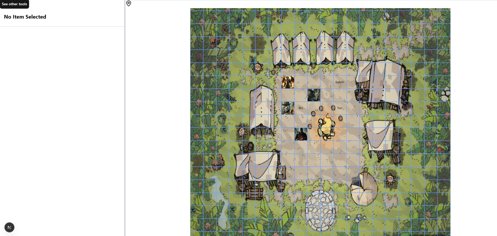
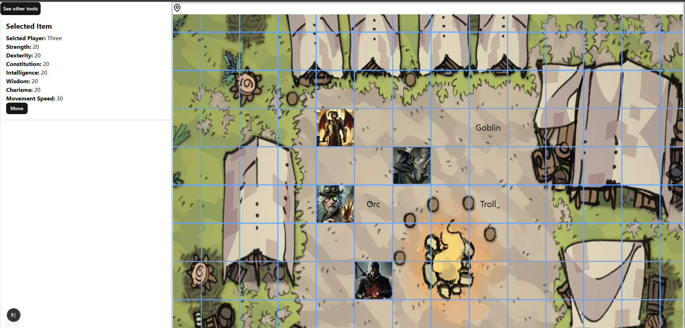

# Virtual Table Top - Frontend

This is a Next.js frontend application for a DND 5e Virtual Table Top.

I am using this as a way to practice my programming skills and therefore will be using very minimal generative AI in the development of this project. the second goal of this project is to make a fun and easy to use DND tool for my friends and I to use while playing our sessions online. 

## Features

- Interactive grid-based battle map with zoom/pan controls
- Player and NPC token management
- Character stat tracking (Strength, Dexterity, Constitution, Intelligence, Wisdom, Charisma)
- Token movement system
- Custom background support

## Tech Stack

- **Framework**: Next.js 16.1.0
- **React**: 19.2.3
- **TypeScript**: 5.x
- **Styling**: Tailwind CSS 4
- **UI Components**: shadcnUI
- **Map Controls**: react-zoom-pan-pinch

## Getting Started

Navigate to Frontend:
```bash
cd virtual-table-top
```

Install dependencies:
```bash
pnpm install
```

Run development server:
```bash
pnpm dev
```

## Project Structure

```
virtual-table-top/
├── app/              # Next.js app directory
├── components/       # React components
│   ├── ui/          # Reusable UI components
│   └── grid.tsx     # Main grid component
├── lib/             # Utility libraries
├── types/           # TypeScript type definitions
├── utils/           # Helper functions
├── public/          # Static assets (backgrounds, tokens)
```


## Next Main Goals
- Implement real-time multiplayer functionality using WebSockets
- Mobile Support
- Built in map builder
- Attack and other roll calculations

## images (*images may be outdated*)
homePage

playerSelected

tools


